<div align="center">



<br/>

[](https://git.io/typing-svg)

<br/>

[](https://github.com/Omerfaruk-aydn)
[](https://github.com/Omerfaruk-aydn)
[](https://github.com/Omerfaruk-aydn)
[](#)

</div>

<br/>

<br/>

<table>
  <tr>
    <td width="55%" valign="top">

### 👨‍💻 About Me

```ts
const omerFarukAydin = {
  location: "İstanbul, Türkiye",
  role: "Full-Stack Developer",
  focus: [
    "modern web applications",
    "clean user interfaces",
    "backend APIs",
    "automation",
    "AI-assisted workflows"
  ],
  principles: [
    "ship usable products",
    "write readable code",
    "keep interfaces fast",
    "learn by building"
  ]
};
```
    </td>
    <td width="45%" valign="top">

### 🚀 Current Direction

- 🔭 **Building:** Full-stack product development
- 🌱 **Ecosystems:** React, Next.js, and TypeScript
- ⚡ **Tooling:** Node.js and Python-based automation
- 🗄️ **Architecture:** Database-backed applications
- 🌐 **Open Source:** Strengthening GitHub presence

<br/>

### 💼 Connect

<a href="mailto:omerfarukaydin3455@gmail.com"></a>
<a href="https://github.com/Omerfaruk-aydn"></a>
<a href="https://www.linkedin.com/in/omerfarukaydin/"></a>
    </td>
  </tr>
</table>

<br/>

<br/>

<div align="center">

## 🛠️ Core Stack

<br/>

**Languages & Frontend**<br/>
<a href="https://skillicons.dev">
  
</a>

<br/>

**Backend, Databases & Tools**<br/>
<a href="https://skillicons.dev">
  
</a>

</div>

<br/>

<br/>

## 📊 GitHub Analytics

<div align="center">

<table>
  <tr>
    <td align="center">
      
    </td>
    <td align="center">
      
    </td>
  </tr>
  <tr>
    <td colspan="2" align="center">
      
    </td>
  </tr>
</table>

</div>

<br/>

<br/>

## 🏆 Achievements & Contributions

<div align="center">


<br/>
<br/>


<br/>
<br/>

<!-- 
  NOTE: The Snake Animation below requires the GitHub Action included in `.github/workflows/snake.yml` to run at least once. 
  It creates the `output` branch containing these SVG files. 
-->
<picture>
  <source media="(prefers-color-scheme: dark)" srcset="https://raw.githubusercontent.com/Omerfaruk-aydn/Omerfaruk-aydn/output/dist/github-contribution-grid-snake-dark.svg">
  <source media="(prefers-color-scheme: light)" srcset="https://raw.githubusercontent.com/Omerfaruk-aydn/Omerfaruk-aydn/output/dist/github-contribution-grid-snake.svg">
  
</picture>

</div>

<br/>

<br/>

<div align="center">


<sub><b>Clean code. Sharp interfaces. Practical products.</b></sub>

</div>
